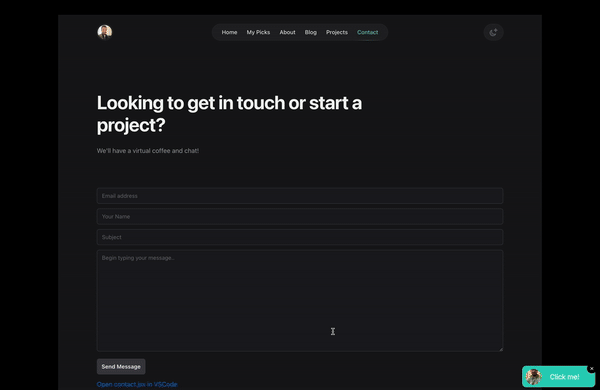

# React Edit File Link



A React component to open files directly in VSCode, enhancing developer productivity by providing quick access to file editing.

## Features

- Open specified files directly in VSCode.
- Development-only feature to avoid cluttering the production UI.
- Customizable link text and styles.

## Installation

To install the package, use npm:

```bash
npm install react-edit-file-link
```

Or with yarn:

```bash
yarn add react-edit-file-link
```

## First, import the EditFileLink component into your React project:

```
import React from 'react';
import { EditFileLink } from 'react-edit-file-link';

function App() {
  return (
    <div>
      <h1>Test EditFileLink Component</h1>
      <EditFileLink file={import.meta.url} name="App" />
    </div>
  );
}

export default App;
```

## Props

The `EditFileLink` component accepts the following props:

- `file` (string, required): The path of the file to open in VSCode.
- `name` (string, optional): The name to display in the link text. If not provided, defaults to "Open in VSCode".
- `className` (string, optional): Additional CSS classes to style the link. Defaults to `"text-blue-600 py-2"`.

## License

This project is licensed under the MIT License. See the LICENSE file for details.

## Contributing

Contributions are welcome! Please open an issue or submit a pull request with your improvements.

## Buy me coffee?

If you wanna have coffee you can support [here](https://www.paypal.com/paypalme/jerrickhakim).
